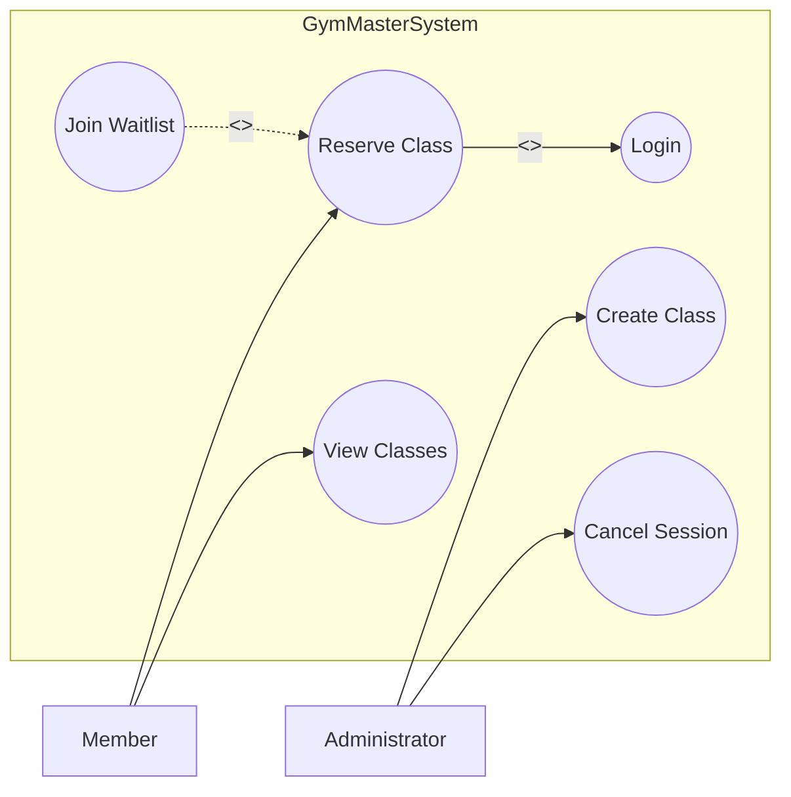
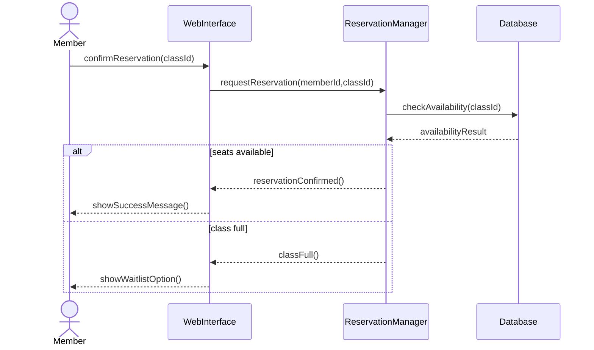
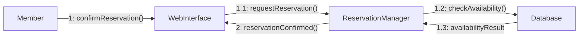

# Entornos-7.5_AGD
ej 1
Muestra los actores (Member y Administrator) y las acciones que pueden hacer en el sistema GymMaster, como ver o reservar clases. También incluye login (include) y lista de espera (extend).

ej 2
Muestra el proceso cuando un socio confirma una reserva. El sistema comprueba en la base de datos si hay plazas y confirma la reserva o informa que la clase está llena.

ej 3
Este diagrama muestra la comunicación entre los objetos del sistema durante el proceso de reserva. Los números indican el orden en el que se envían los mensajes.

