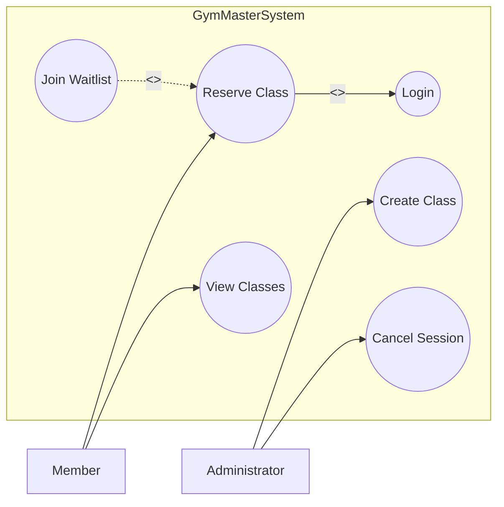
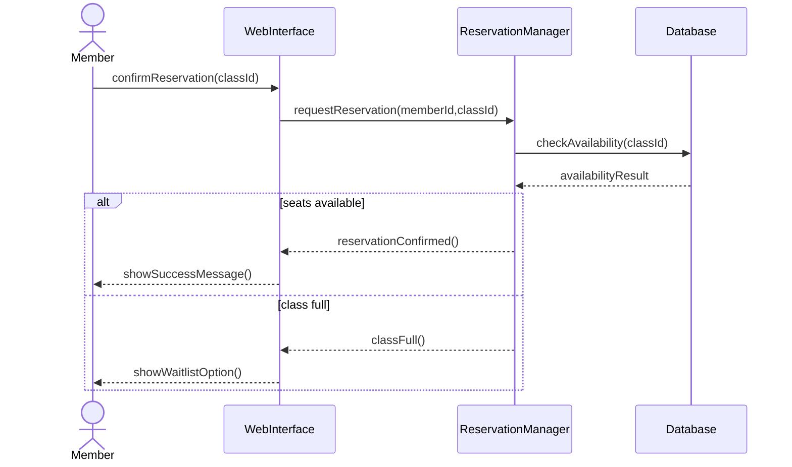

# Entornos-7.5_AGD
ej 1

```mermaid
flowchart LR

subgraph GymMasterSystem

Login((Login))
ReserveClass((Reserve Class))
JoinWaitlist((Join Waitlist))
ViewClasses((View Classes))
CreateClass((Create Class))
CancelSession((Cancel Session))

ReserveClass -->|<<include>>| Login
JoinWaitlist -.->|<<extend>>| ReserveClass

end

Member --> ViewClasses
Member --> ReserveClass

Administrator --> CreateClass
Administrator --> CancelSession

```
ej 2

```mermaid
sequenceDiagram

actor Member
participant WebInterface
participant ReservationManager
participant Database

Member ->> WebInterface: confirmReservation(classId)

WebInterface ->> ReservationManager: requestReservation(memberId,classId)

ReservationManager ->> Database: checkAvailability(classId)

Database -->> ReservationManager: availabilityResult

alt seats available

ReservationManager -->> WebInterface: reservationConfirmed()
WebInterface -->> Member: showSuccessMessage()

else class full

ReservationManager -->> WebInterface: classFull()
WebInterface -->> Member: showWaitlistOption()

end
```
